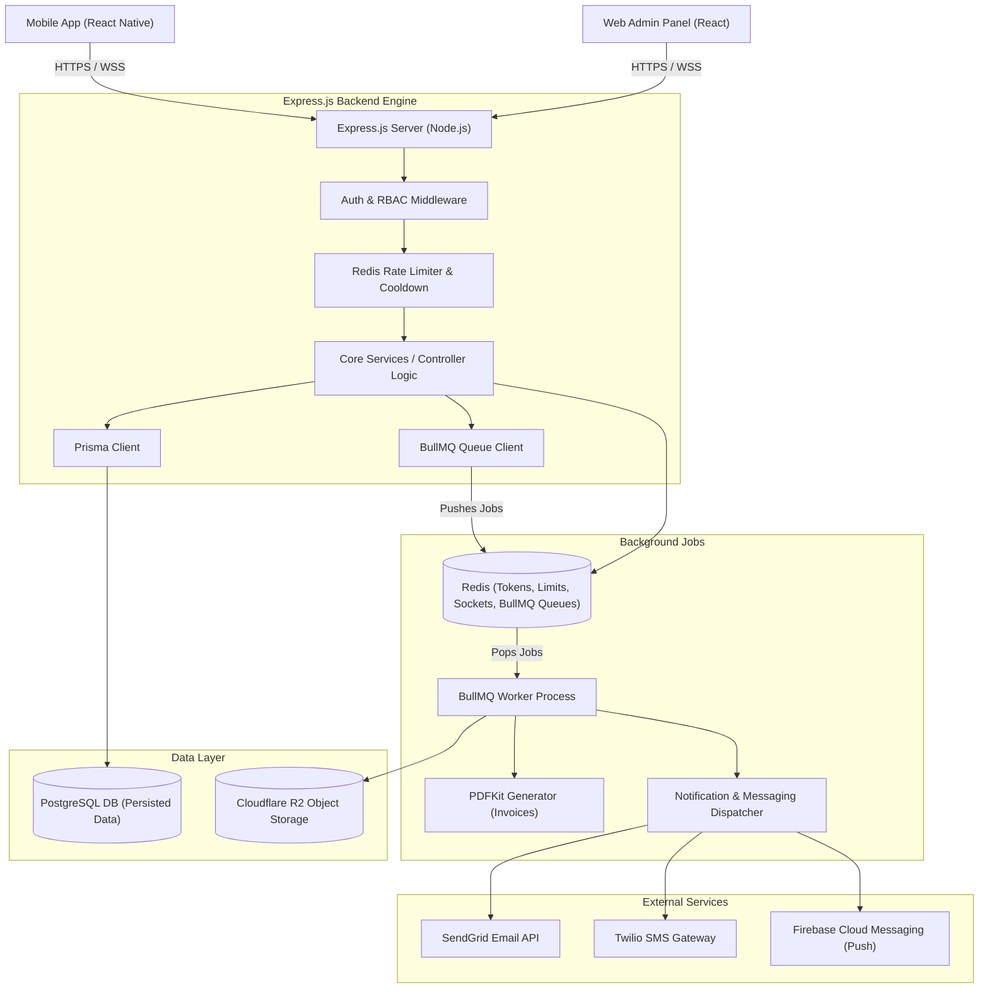

# MARCOS Platform: Backend Architecture & Implementation Guide

This document defines the backend system architecture, directory structures, security mechanisms, database design, API routing, real-time communications, and testing methodologies for the **MARCOS Platform** backend service.

---

## 1. System Architecture & Tech Stack

The backend functions as the secure orchestrator of the MARCOS ecosystem, serving both the React Native Mobile App and the React Web Admin Panel. To avoid blocking the event loop on heavy tasks, asynchronous operations are offloaded to background workers.



### Core Technologies
*   **Runtime:** Node.js (v20+ LTS)
*   **Web Framework:** Express.js with TypeScript
*   **Database ORM:** Prisma ORM
*   **Primary Database:** PostgreSQL (v15+)
*   **Key-Value & Cache Store:** Redis (for session blacklisting, rate limiting, OTP limits, Socket.io scaling, and BullMQ queue management)
*   **Queue System:** BullMQ (for robust, Redis-backed asynchronous background processing)
*   **Real-time Engine:** Socket.io (using Redis Adapter)
*   **Object Storage:** Cloudflare R2 (S3 API compatible)

---

## 2. Directory Structure

The backend sits inside the monorepo workspace at `apps/backend/`. Below is the directory structure:

```text
apps/backend/
├── prisma/
│   ├── schema.prisma            # Prisma schema models & database source settings
│   └── migrations/              # Auto-generated SQL migration history
├── src/
│   ├── config/                  # Server configuration and environment setup
│   │   ├── db.ts                # Prisma client instantiation
│   │   ├── redis.ts             # Redis client instantiation
│   │   └── env.ts               # Env parsing & validation using Zod
│   ├── controllers/             # Request handlers (processes inputs, returns responses)
│   │   ├── auth.controller.ts
│   │   ├── product.controller.ts
│   │   ├── measurement.controller.ts
│   │   ├── appointment.controller.ts
│   │   ├── visit.controller.ts
│   │   ├── billing.controller.ts
│   │   └── admin.controller.ts
│   ├── middlewares/             # Request interceptors
│   │   ├── auth.middleware.ts   # JWT validation & role assertion
│   │   ├── rateLimit.middleware.ts # Redis rate limiter
│   │   ├── upload.middleware.ts # Multer buffer & magic-number type validator
│   │   ├── validate.middleware.ts # Zod request body/query validator
│   │   └── error.middleware.ts  # Global exception catcher & log formatter
│   ├── queues/                  # BullMQ definition and jobs setup
│   │   ├── queue.config.ts      # Queue connection definitions
│   │   ├── jobs.producer.ts     # Interface to push jobs to queues
│   │   └── jobs.worker.ts       # Job handlers (processes PDF, emails, points)
│   ├── routes/                  # Express routing mappings
│   │   ├── index.ts             # Route combiner (prefixed with /api/v1)
│   │   ├── auth.routes.ts
│   │   ├── product.routes.ts
│   │   ├── measurement.routes.ts
│   │   ├── appointment.routes.ts
│   │   ├── visit.routes.ts
│   │   ├── billing.routes.ts
│   │   └── admin.routes.ts
│   ├── services/                # Business logic layer
│   │   ├── auth.service.ts
│   │   ├── email.service.ts     # SendGrid service wrapper
│   │   ├── sms.service.ts       # Twilio service wrapper
│   │   ├── notification.service.ts # FCM integration
│   │   ├── pdf.service.ts       # PDFKit generator wrapper
│   │   └── r2.service.ts        # Cloudflare R2 S3 Upload/Delete helper
│   ├── utils/                   # General utility logic
│   │   ├── logger.ts            # Winston logger with CloudWatch/Datadog stream hook
│   │   └── crypto.ts            # AES-256-GCM functions & password helper
│   ├── socket/                  # Real-time WebSockets
│   │   ├── socket.handler.ts    # Main Socket.io events & connection middleware
│   │   └── socket.adapter.ts    # Redis Adapter configuration
│   └── app.ts                   # Express application configurations
├── tests/                       # Integration and Unit tests
│   ├── setup.ts                 # Test database configuration cleaner
│   ├── auth.test.ts
│   ├── measurement.test.ts
│   ├── jobs.test.ts             # BullMQ isolated sandbox job tests
│   └── socket.test.ts
├── tsconfig.json
└── package.json
```

---

## 3. Production-Level Security Specifications

To prevent data breaches and comply with standard security policies, the backend enforces several layers of defense-in-depth:

### 3.1 Authentication & Token Mechanics
*   **Dual-Token Setup**: Uses a short-lived Access Token (JWT, 15-minute lifespan) and a long-lived Refresh Token.
    *   *Web Admin Clients*: Refresh tokens are saved in Secure, HTTP-Only, SameSite=Strict cookies to eliminate XSS theft.
    *   *Mobile App Clients*: Refresh tokens are transmitted in response bodies and stored in the device's secure vault (`SecureStore` / `MMKV` encrypted), sent back in the HTTP authorization headers on refresh requests.
*   **Refresh Token Rotation (RTR)**: Every call to `/auth/refresh` returns a *new* Access Token and a *new* Refresh Token. The old refresh token is marked as revoked in Redis. If a revoked refresh token is presented, the system detects a potential breach, invalidates the entire token family (deleting all active tokens for that user), and flags it as a security event.
*   **Blacklisting**: Upon `/auth/logout`, the refresh token is placed in Redis with a TTL matching its expiry time. The auth middleware asserts that incoming tokens are not present on the Redis blacklist.
*   **Password Encryption**: Hashed utilizing `Argon2id` (configured with modern resource thresholds to protect against custom GPU/ASIC cracking arrays).

### 3.2 Abuse Prevention & Rate Limiting
*   **Global Rate Limits**: Managed via Redis; limited to 100 requests per 15-minute window per IP address.
*   **Sensitive Routes (OTP requests, Login, Password Reset)**: Tightened to a maximum of 5 requests per 15-minute window per IP / Phone Identifier.
*   **OTP Block Rules & Account Cooldown**:
    1. OTPs have a 5-minute expiry, hashed and stored in Redis.
    2. If a phone number or email triggers **3 failed verification attempts**, further OTP requests or validations are blocked for **15 minutes**.
    3. Blocks are managed programmatically via Redis key prefixes: `cooldown:otp:<identifier>` with a TTL of 900 seconds.

### 3.3 Input Filtering & Server-Side File Verification
*   **Strict JSON schemas**: Validates all input structures (`req.body`, `req.query`, `req.params`) using `Zod` schemas prior to hitting controller functions.
*   **Binary File Validation (Multer + magic-bytes analysis)**:
    1. Files uploaded via Multer are stored temporarily in buffer memory.
    2. The server reads the first 4100 bytes using `file-type` to inspect the magic binary headers (not relying on the client-sent MIME type or file extension).
    3. Allowed MIME types: `image/jpeg`, `image/png`, `application/pdf`.
    4. Size restrictions: Product Images <= **5MB**; PDF Invoices <= **10MB**.
    5. Validated file buffers are streamed directly to Cloudflare R2; file paths are saved to PostgreSQL.

### 3.4 Webhook Signature Validation
Webhook endpoints from third-party payment gateways (Stripe, Razorpay) are public-facing but must be strictly validated before processing payload events.
*   **Raw Body Preservation**: Signature validation requires the raw request body buffer to compute HMAC checksums. Standard JSON body parsers alter formatting. The Express app must preserve the raw body for webhook verification:
    ```typescript
    import express from 'express';
    
    // Webhook route configuration using raw parser
    app.use('/api/v1/billing/webhook', express.raw({ type: 'application/json' }));
    ```
*   **Stripe Webhook Validation**:
    1. Retrieve the signature header: `Stripe-Signature`.
    2. Extract the payload raw body buffer.
    3. Compute HMAC-SHA256 of the raw body using the Stripe webhook signing secret (retrieved from secure environment variables).
    4. Validate and construct the event using Stripe SDK:
       `stripe.webhooks.constructEvent(req.body, sigHeader, webhookSecret)` which uses timing-safe comparisons internally.
*   **Razorpay Webhook Validation**:
    1. Retrieve the signature header: `X-Razorpay-Signature`.
    2. Compute the HMAC-SHA256 signature on the raw request body string:
       ```typescript
       import crypto from 'crypto';
       
       const generatedSignature = crypto
         .createHmac('sha256', process.env.RAZORPAY_WEBHOOK_SECRET!)
         .update(req.body.toString())
         .digest('hex');
       ```
    3. Compare the generated signature with the header signature using `crypto.timingSafeEqual` to prevent timing attacks:
       ```typescript
       const isMatch = crypto.timingSafeEqual(
         Buffer.from(generatedSignature, 'utf-8'),
         Buffer.from(receivedSignature, 'utf-8')
       );
       ```

### 3.5 Data Encryption & Logging
*   **In-Transit**: HTTPS enforced using TLS 1.3.
*   **Sensitive Columns**: Application-level AES-256-GCM encryption is applied for highly confidential fields (such as specific profile notes, physical address details, and phone numbers in compliance with local privacy frameworks).
*   **Structured Auditing & Monitoring**:
    *   `Winston` logs are serialized to JSON format and streamed to CloudWatch or Datadog.
    *   Programmatic database alerts are triggered whenever the security system detects:
        1. `FAILED_LOGIN` - More than 10 failed login attempts on a single account or IP within 1 minute.
        2. `EXPORT_MEASUREMENTS` - Admin accounts requesting export lists of more than 10 customer measurements within 10 seconds.
        3. `UNAUTHORIZED_ACCESS_ATTEMPT` - Non-admin or non-owner profiles attempting to fetch measurements.

---

## 4. Database Schema Documentation

### 4.1 Schema Definitions (`schema.prisma`)
Below is the complete, source-of-truth Prisma database schema mapping database tables and relations:

```prisma
datasource db {
  provider = "postgresql"
  url      = env("DATABASE_URL")
}

generator client {
  provider = "prisma-client-js"
}

enum Role {
  CUSTOMER
  STAFF
  ADMIN
  SUPERADMIN
}

enum AppointmentStatus {
  PENDING
  CONFIRMED
  CANCELLED
  RESCHEDULED
}

enum AppointmentType {
  MEASUREMENT
  CONSULTATION
  PRODUCT_SELECTION
}

enum VisitStatus {
  PENDING
  ASSIGNED
  IN_PROGRESS
  COMPLETED
}

enum OrderStatus {
  PENDING
  PAID
  PROCESSING
  SHIPPED
  DELIVERED
  CANCELLED
}

enum PaymentStatus {
  PENDING
  COMPLETED
  FAILED
  REFUNDED
}

enum BannerLocation {
  HOME_SLIDER
  PROMOTIONAL_SECTION
  OFFER_SECTION
}

enum TicketStatus {
  OPEN
  IN_PROGRESS
  RESOLVED
  CLOSED
}

enum StockStatus {
  IN_STOCK
  OUT_OF_STOCK
  LOW_STOCK
}

enum NotificationType {
  APPOINTMENT_REMINDER
  PROMOTIONAL_BLAST
  ORDER_UPDATE
}

model User {
  id                String            @id @default(uuid())
  email             String            @unique
  phoneNumber       String            @unique
  passwordHash      String
  fullName          String
  gender            String?
  address           String?
  role              Role              @default(CUSTOMER)
  createdAt         DateTime          @default(now())
  updatedAt         DateTime          @updatedAt
  
  // Loyalty & Referrals
  pointsBalance     Int               @default(0)
  referralCode      String            @unique
  referredById      String?
  referredBy        User?             @relation("UserReferrals", fields: [referredById], references: [id])
  referrals         User[]            @relation("UserReferrals")
  
  // Relations
  measurementProfiles MeasurementProfile[]
  appointments       Appointment[]
  visitRequests      StoreVisit[]      @relation("CustomerVisits")
  assignedVisits     StoreVisit[]      @relation("StaffVisits")
  orders             Order[]
  supportTickets     SupportTicket[]
  pointTransactions  PointTransaction[]
  notifications      NotificationRecipient[]
  auditLogs          AuditLog[]
  cartItems          CartItem[]
  couponsUsed        UserCoupon[]
  visitReports       VisitReport[]     @relation("StaffReports")
}

model MeasurementProfile {
  id                String            @id @default(uuid())
  userId            String
  user              User              @relation(fields: [userId], references: [id], onDelete: Cascade)
  profileName       String            // e.g., "Self", "Mother", "Sister"
  
  // Women Measurements
  fullLength        Decimal?          @db.Decimal(5, 2)
  shoulderWidth     Decimal?          @db.Decimal(5, 2)
  upperChest        Decimal?          @db.Decimal(5, 2)
  bust              Decimal?          @db.Decimal(5, 2)
  waist             Decimal?          @db.Decimal(5, 2)
  hip               Decimal?          @db.Decimal(5, 2)
  armLength         Decimal?          @db.Decimal(5, 2)
  sleeveLength      Decimal?          @db.Decimal(5, 2)
  neck              Decimal?          @db.Decimal(5, 2)
  seat              Decimal?          @db.Decimal(5, 2)
  skirtLength       Decimal?          @db.Decimal(5, 2)
  pantLength        Decimal?          @db.Decimal(5, 2)
  
  tailorNotes       String?
  createdAt         DateTime          @default(now())
  updatedAt         DateTime          @updatedAt
  
  history           MeasurementHistory[]
}

model MeasurementHistory {
  id                String            @id @default(uuid())
  profileId         String
  profile           MeasurementProfile @relation(fields: [profileId], references: [id], onDelete: Cascade)
  changedBy         String            // Admin User ID
  previousValues    Json              // Store snapshots of measurements changed
  newValues         Json
  changedAt         DateTime          @default(now())
}

model Category {
  id                String            @id @default(uuid())
  name              String            @unique
  slug              String            @unique
  order             Int               @default(0)
  products          Product[]
  createdAt         DateTime          @default(now())
  updatedAt         DateTime          @updatedAt
}

model Product {
  id                String            @id @default(uuid())
  name              String
  description       String
  price             Decimal           @db.Decimal(10, 2)
  materialInfo      String?
  images            String[]          // Array of verified S3/R2 URLs
  categoryId        String
  category          Category          @relation(fields: [categoryId], references: [id])
  isTrending        Boolean           @default(false)
  trendingScheduledAt DateTime?
  
  // Inventory tracking
  inventoryQty      Int               @default(0)
  stockStatus       StockStatus       @default(IN_STOCK)
  
  createdAt         DateTime          @default(now())
  updatedAt         DateTime          @updatedAt
  
  orderItems        OrderItem[]
  cartItems         CartItem[]
}

model CartItem {
  id                String            @id @default(uuid())
  userId            String
  user              User              @relation(fields: [userId], references: [id], onDelete: Cascade)
  productId         String
  product           Product           @relation(fields: [productId], references: [id], onDelete: Cascade)
  quantity          Int               @default(1)
  createdAt         DateTime          @default(now())

  @@unique([userId, productId])
}

model Coupon {
  id                String            @id @default(uuid())
  code              String            @unique
  discountPercent   Int               @default(0)
  discountFlat      Decimal           @default(0.00) @db.Decimal(10, 2)
  maxDiscount       Decimal?          @db.Decimal(10, 2)
  expiryDate        DateTime
  isActive          Boolean           @default(true)
  
  // Usage tracking
  maxUses           Int               @default(100)
  usedCount         Int               @default(0)
  
  createdAt         DateTime          @default(now())
  redemptions       UserCoupon[]
}

model UserCoupon {
  id                String            @id @default(uuid())
  userId            String
  user              User              @relation(fields: [userId], references: [id], onDelete: Cascade)
  couponId          String
  coupon            Coupon            @relation(fields: [couponId], references: [id], onDelete: Cascade)
  usedAt            DateTime          @default(now())

  @@unique([userId, couponId])
}

model Appointment {
  id                String            @id @default(uuid())
  userId            String
  user              User              @relation(fields: [userId], references: [id])
  date              DateTime
  timeSlot          String            // e.g., "10:00 - 11:00"
  productType       String
  type              AppointmentType
  status            AppointmentStatus @default(PENDING)
  notes             String?
  createdAt         DateTime          @default(now())
  updatedAt         DateTime          @updatedAt
}

model StoreVisit {
  id                String            @id @default(uuid())
  customerId        String
  customer          User              @relation("CustomerVisits", fields: [customerId], references: [id])
  assignedStaffId   String?
  assignedStaff     User?             @relation("StaffVisits", fields: [assignedStaffId], references: [id])
  preferredDate     DateTime
  confirmedDate     DateTime?
  address           String
  requirements      String
  status            VisitStatus       @default(PENDING)
  createdAt         DateTime          @default(now())
  updatedAt         DateTime          @updatedAt
  
  report            VisitReport?
}

model VisitReport {
  id              String            @id @default(uuid())
  visitId         String            @unique
  visit           StoreVisit        @relation(fields: [visitId], references: [id], onDelete: Cascade)
  staffId         String
  staff           User              @relation("StaffReports", fields: [staffId], references: [id])
  completionNotes String
  mediaUrls       String[]          // Photo attachments taken during visit
  createdAt       DateTime          @default(now())
  updatedAt         DateTime          @updatedAt
}

model PointTransaction {
  id                String            @id @default(uuid())
  userId            String
  user              User              @relation(fields: [userId], references: [id])
  points            Int               // Positive for earn, negative for redeem
  reason            String            // e.g., "Purchase", "Referral", "Campaign Bonus"
  createdAt         DateTime          @default(now())
}

model Order {
  id                String            @id @default(uuid())
  userId            String?           // Optional for offline guest purchases (manual sales)
  user              User?             @relation(fields: [userId], references: [id])
  status            OrderStatus       @default(PENDING)
  totalAmount       Decimal           @db.Decimal(10, 2)
  taxAmount         Decimal           @db.Decimal(10, 2)
  discountAmount    Decimal           @default(0.00) @db.Decimal(10, 2)
  payableAmount     Decimal           @db.Decimal(10, 2)
  paymentMethod     String            // Cash, Online, Card
  isOfflineSales    Boolean           @default(false)
  invoiceNumber     String            @unique
  
  // Future proof gateway payment tracking
  paymentStatus     PaymentStatus     @default(PENDING)
  transactionId     String?           @unique
  paymentGateway    String?           // e.g. "STRIPE", "RAZORPAY"
  gatewayResponse   Json?             // Raw gateway response payload
  
  createdAt         DateTime          @default(now())
  updatedAt         DateTime          @updatedAt
  
  orderItems        OrderItem[]
  invoice           Invoice?
}

model OrderItem {
  id                String            @id @default(uuid())
  orderId           String
  order             Order             @relation(fields: [orderId], references: [id], onDelete: Cascade)
  productId         String
  product           Product           @relation(fields: [productId], references: [id])
  quantity          Int
  price             Decimal           @db.Decimal(10, 2)
}

model Invoice {
  id                String            @id @default(uuid())
  orderId           String            @unique
  order             Order             @relation(fields: [orderId], references: [id])
  pdfUrl            String            // Cloud storage link
  createdAt         DateTime          @default(now())
}

model Banner {
  id                String            @id @default(uuid())
  imageUrl          String
  title             String?
  targetUrl         String?           // Deep link or web link
  location          BannerLocation    @default(HOME_SLIDER)
  scheduledStart    DateTime?
  scheduledEnd      DateTime?
  isActive          Boolean           @default(true)
  clicks            Int               @default(0)
  createdAt         DateTime          @default(now())
}

model Notification {
  id                String            @id @default(uuid())
  title             String
  body              String
  type              NotificationType
  isScheduled       Boolean           @default(false)
  scheduledTime     DateTime?
  createdAt         DateTime          @default(now())
  
  recipients        NotificationRecipient[]
}

model NotificationRecipient {
  id                String            @id @default(uuid())
  notificationId    String
  notification      Notification      @relation(fields: [notificationId], references: [id], onDelete: Cascade)
  userId            String
  user              User              @relation(fields: [userId], references: [id], onDelete: Cascade)
  isRead            Boolean           @default(false)
  readAt            DateTime?
}

model SupportTicket {
  id                String            @id @default(uuid())
  userId            String
  user              User              @relation(fields: [userId], references: [id])
  subject           String
  description       String
  status            TicketStatus      @default(OPEN)
  createdAt         DateTime          @default(now())
  updatedAt         DateTime          @updatedAt
}

model AuditLog {
  id                String            @id @default(uuid())
  userId            String?           // Admin/Staff who executed the action
  user              User?             @relation(fields: [userId], references: [id])
  action            String            // e.g. "UPDATE_MEASUREMENT", "DELETE_PRODUCT"
  details           Json              // Structured JSON containing a human-readable 'message' and metadata
  ipAddress         String?
  createdAt         DateTime          @default(now())
}
```

### 4.2 Data Flow & ER Diagram
Refer to the ERD diagram in **Section 1** for relations mapping.

### 4.3 Inventory Integrity (`stockStatus` vs `inventoryQty`)
*   **Derived Logic Rule**: The `Product.stockStatus` enum (`IN_STOCK`, `LOW_STOCK`, `OUT_OF_STOCK`) is a programmatically derived state whose source of truth is `Product.inventoryQty`.
*   **Write Restriction**: Clients cannot write directly to `stockStatus` via APIs.
*   **Automatic Synchronization**:
    Whenever `inventoryQty` is modified (such as when inventory is adjusted by an Admin or decremented during sales processing), the update must pass through a single codebase function in `product.service.ts` or `billing.service.ts` that enforces the status transition rules:
    ```typescript
    export function computeStockStatus(qty: number): StockStatus {
      if (qty <= 0) return 'OUT_OF_STOCK';
      if (qty <= 10) return 'LOW_STOCK'; // Low stock threshold: 10 units
      return 'IN_STOCK';
    }
    
    // Updates must execute inside a database transaction
    await prisma.product.update({
      where: { id: productId },
      data: {
        inventoryQty: newQty,
        stockStatus: computeStockStatus(newQty)
      }
    });
    ```
    This eliminates data drift between numeric quantities and the textual search filters used on catalog grids.

---

## 5. API Endpoints Specification

All routes are prefixed with `/api/v1/` and expect JSON payloads unless uploading binary files.

### 5.1 Authentication Module (`/auth`)

#### `POST /auth/register`
*   **Access**: Public
*   **Body Validation**:
    ```json
    {
      "email": "user@example.com",
      "phoneNumber": "+919876543210",
      "password": "SecurePassword123!",
      "fullName": "Jane Doe"
    }
    ```
*   **Response (201 Created)**:
    ```json
    {
      "success": true,
      "message": "User registered successfully",
      "accessToken": "eyJhbGciOi...",
      "user": {
        "id": "usr_uuid",
        "email": "user@example.com",
        "role": "CUSTOMER"
      }
    }
    ```

#### `POST /auth/login`
*   **Access**: Public
*   **Body Validation**:
    ```json
    {
      "email": "user@example.com",
      "password": "SecurePassword123!"
    }
    ```

*   **Response for Web Admin Clients**:
    *   *Headers*:
        `Set-Cookie: refreshToken=eyJhbGci...; Path=/; HttpOnly; Secure; SameSite=Strict; Max-Age=604800`
    *   *JSON Payload*:
        ```json
        {
          "success": true,
          "accessToken": "eyJhbGciOi...",
          "user": {
            "id": "adm_uuid",
            "email": "admin@example.com",
            "role": "ADMIN",
            "fullName": "System Administrator"
          }
        }
        ```

*   **Response for Mobile App Clients**:
    *   *JSON Payload (both tokens in body)*:
        ```json
        {
          "success": true,
          "accessToken": "eyJhbGciOi...",
          "refreshToken": "eyJhbGciOi...",
          "user": {
            "id": "cust_uuid",
            "email": "user@example.com",
            "role": "CUSTOMER",
            "fullName": "Jane Doe"
          }
        }
        ```

#### `POST /auth/otp/send`
*   **Access**: Public
*   **Body**: `{ "phoneNumber": "+919876543210" }` or `{ "email": "user@example.com" }`
*   **Description**: Dispatches a 6-digit OTP. Enforces global limits and cooldown rules in Redis.

#### `POST /auth/otp/verify`
*   **Access**: Public
*   **Body**: `{ "phoneNumber": "+919876543210", "code": "123456" }`
*   **Response (200 OK)**: Authenticates session, clears temporary Redis OTP records, returns session tokens (following the web/mobile split shapes detailed in `login`).

#### `POST /auth/refresh`
*   **Access**: Public
*   **Cookies/Headers**: Expects refresh token.
*   **Response (200 OK)**: Re-evaluates refresh key, rotates family tokens, returns new keys.

#### `POST /auth/logout`
*   **Access**: Authenticated
*   **Description**: Extracts refresh token from request, blacklists it in Redis, clears cookies.

---

### 5.2 Products & Cart Module (`/products`, `/cart`)

#### `GET /products`
*   **Access**: Public
*   **Query Params**: `page`, `limit`, `category`, `search`, `sortBy` (price, date), `sortOrder` (asc, desc)
*   **Response (200 OK)**: Paginated arrays.

#### `GET /products/:id`
*   **Access**: Public
*   **Response (200 OK)**: Product attributes and real-time inventory quantity.

#### `GET /cart`
*   **Access**: Authenticated (Customer)
*   **Response (200 OK)**: Array of cart items with populated product metadata.

#### `POST /cart`
*   **Access**: Authenticated (Customer)
*   **Body**: `{ "productId": "prod_uuid", "quantity": 2 }`
*   **Description**: Automatically validates that inventory quantity accommodates request before saving.

#### `POST /cart/coupon`
*   **Access**: Authenticated (Customer)
*   **Body**: `{ "code": "SUMMER50" }`
*   **Response (200 OK)**: Coupon details if valid; calculates discount percent, flat discounts, maximum discount, and checks expiry dates.

---

### 5.3 Measurement Module (`/measurements`)

#### `GET /measurements`
*   **Access**: Authenticated (Customers get their own profiles; Admin/Staff can fetch any user profile).
*   **Response (200 OK)**: Profile cards detailing individual sizing measurements.

#### `POST /measurements`
*   **Access**: Authenticated (Customer/Staff)
*   **Body**: Creates sub-profiles (e.g., "Mother", "Sister") under the User ID.

#### `DELETE /measurements/:id`
*   **Access**: Authenticated (Owner of the profile or Admin/Staff)
*   **Description**: Permanently deletes a measurement profile from the database. Cascade constraints automatically clean up the associated edit history in `MeasurementHistory`.
*   **Response (200 OK)**: `{ "success": true, "message": "Measurement profile deleted successfully" }`

#### `PUT /measurements/:id`
*   **Access**: Admin / Staff Only (Customers receive `403 Forbidden`)
*   **Body**: Measurements decimal list (e.g. waist, bust, hip).
*   **Description**: Updates the dimensions, records a historical snapshot into `MeasurementHistory`, and writes a record in `AuditLog` indicating which Staff updated the measurements.

#### `GET /measurements/:id/history`
*   **Access**: Admin / Staff Only
*   **Response (200 OK)**: List of changes over time. Shows who modified the values, previous values, and current values.

---

### 5.4 Appointment Module (`/appointments`)

#### `GET /appointments`
*   **Access**: Authenticated
*   **Query Params**: `page`, `limit`, `status`, `startDate`, `endDate`, `userId`, `search`
*   **Description**: Admin retrieves all bookings matching calendars; customers receive only their own list.

#### `POST /appointments`
*   **Access**: Authenticated
*   **Body**: `{ "date": "2026-06-15T10:00:00Z", "timeSlot": "10:00 - 11:00", "productType": "Sherwani", "type": "MEASUREMENT" }`
*   **Description**: Checks database for slot constraints to prevent double-booking.

#### `PUT /appointments/:id`
*   **Access**: Authenticated
*   **Description**: Modifies or reschedules. Prevents cancellations if the start time is less than 2 hours away.

---

### 5.5 Store Visit Module (`/visits`)

#### `POST /visits`
*   **Access**: Authenticated (Customer)
*   **Body**: `{ "preferredDate": "2026-06-15T14:30:00Z", "address": "...", "requirements": "..." }`
*   **Description**: Customer submits requests for physical store visits.

#### `PUT /visits/:id/assign`
*   **Access**: Admin Only
*   **Body**: `{ "assignedStaffId": "staff_uuid", "confirmedDate": "2026-06-15T15:00:00Z" }`
*   **Description**: Sets status to `ASSIGNED`, records the actual `confirmedDate` (which may differ from customer's preferred date), and sends real-time updates to staff and customer.

#### `PUT /visits/:id/status`
*   **Access**: Staff / Admin Only
*   **Body (Multipart Form Data)**:
    *   `status`: "COMPLETED"
    *   `completionNotes`: "Finished measurements and fabric selection."
    *   `images`: (Files for verification)
*   **Description**: Updates visit state, generates a `VisitReport`, validates photo uploads through binary check, uploads to R2, and saves URLs to database.

---

### 5.6 Billing & Webhooks (`/billing`)

#### `POST /billing/invoice`
*   **Access**: Admin / Staff Only
*   **Body**:
    ```json
    {
      "userId": "customer_uuid",
      "items": [
        { "productId": "prod_uuid", "quantity": 1, "price": 12000.00 }
      ],
      "discountAmount": 1000.00,
      "paymentMethod": "CARD",
      "isOfflineSales": true
    }
    ```
*   **Description**: Creates an Order. Checks and decrements inventory quantity (updating `stockStatus` dynamically). Schedules background asynchronous jobs on BullMQ and returns immediately.

#### `POST /billing/webhook/:gateway`
*   **Access**: Public (Validates signed signature headers)
*   **Headers**: `Stripe-Signature` or `X-Razorpay-Signature`
*   **Description**: Webhook receiver endpoint. Expects a raw request body for HMAC calculation as detailed in **Section 3.4**. Upon successful verification, triggers asynchronous order completion jobs via BullMQ (updating database states and launching notifications).

---

### 5.7 Administrative Controls (`/admin`)

#### `GET /admin/dashboard`
*   **Access**: Admin / SuperAdmin
*   **Response**: Aggregated JSON containing total revenue, order count, pending tasks, and Recharts-friendly data streams.

#### `POST /admin/loyalty/adjust`
*   **Access**: Admin / SuperAdmin
*   **Body**: `{ "userId": "usr_uuid", "points": -100, "reason": "Manual adjustment by Admin" }`
*   **Description**: Adds or deducts points. Enforces floor validation (points balance cannot drop below zero).

---

### 5.8 Notifications Module (`/notifications`)

#### `PUT /notifications/recipients/:id/read`
*   **Access**: Authenticated
*   **Description**: Marks a specific recipient notification record as read.

#### `PUT /notifications/recipients/read-all`
*   **Access**: Authenticated
*   **Description**: Marks all unread notification recipient records for the logged-in user as read in a single transactional query to prevent multiple HTTP requests.
*   **Response (200 OK)**: `{ "success": true, "updatedCount": 8 }`

#### `GET /notifications/history`
*   **Access**: Authenticated
*   **Description**: Retrieve active history of received push notifications.

---

## 6. Real-Time WebSockets (Socket.io)

For horizontal scalability in hosting platforms (Render/Railway), Socket.io utilizes a **Redis Adapter** to distribute messages across multiple backend instances.

### 6.1 Handshake, Auth & Reconnection Cleanup
*   Clients establish connections with `wss://api.marcosapp.com`.
*   A query token parameter is required: `ws.connect({ query: { token: 'JWT_ACCESS_TOKEN' } })`.
*   **Connection & Reconnection**: Connection middleware decodes the JWT, validates user role, and automatically joins the socket to appropriate rooms (`user:{userId}` for all users, `admins` for staff/admin, `superadmins` for superadmins) *prior* to processing any event listeners. This eliminates the need for clients to manually emit `join:room` after a reconnect.
*   **Disconnection Cleanup**: When a client disconnects, Socket.io and the Redis Adapter automatically clean up the socket's room memberships. The server catches the `disconnect` event, purges connection state trackers in Redis, and logs the closure to prevent ghost connection memory leaks.

### 6.2 Rooms & Channels
*   `admins`: Room automatically joined by connections with `role` matching `ADMIN` or `SUPERADMIN`.
*   `superadmins`: Room joined exclusively by `SUPERADMIN` profiles.
*   `user:{userId}`: Personal user room for target customer alerts.

### 6.3 Events Mapping

| Event Name | Direction | Room Target | Payload / Trigger |
| :--- | :--- | :--- | :--- |
| `appointment:created` | Server -> Client | `admins` | Broadcasts new booking metadata |
| `visit:status_changed`| Server -> Client | `user:{userId}`, `admins` | `{ "visitId": "uuid", "status": "IN_PROGRESS" }` |
| `order:placed` | Server -> Client | `admins` | Real-time invoice notification |
| `audit:alert` | Server -> Client | `superadmins` | Triggered when security threshold rules are violated |

---

## 7. Asynchronous Task Processing (BullMQ & Redis)

Heavy operations are processed asynchronously to ensure high HTTP throughput, reliability under high concurrency, and auto-retry capabilities on external API failures.

### 7.1 Queue Architecture
*   **Redis Backend**: Acts as the message broker, storing job metadata, states (delayed, active, completed, failed), and lock records.
*   **Concurrency**: Workers run concurrently with separate worker threads or processes configured via BullMQ configuration:
    `const worker = new Worker(QUEUE_NAME, jobHandler, { connection, concurrency: 5 });`

### 7.2 Core Background Jobs
*   `GENERATE_INVOICE_PDF`: Renders a print-ready PDF using `PDFKit`, streams the output to Cloudflare R2 object storage, updates the `Invoice` database model, and schedules a downstream mail send.
*   `SEND_NOTIFICATION`: Dispatches external notifications (SendGrid email, Twilio SMS, Firebase push alerts). 
*   `CREDIT_REFERRAL_POINTS`: Calculates checkout loyalty credits and rewards referral bonuses.

### 7.3 Failure & Dead-Letter Queue (DLQ) Handling
To prevent silent failure of critical jobs (e.g. R2 outage blocking invoice generation):
*   **Retry Policy**: Jobs are configured with exponential backoffs:
    `{ attempts: 5, backoff: { type: 'exponential', delay: 2000 } }`
*   **Failure Listener**: When a job exhausts all retries, the worker's `'failed'` event listener catches the failure:
    1.  Logs the error via Winston (`level: 'error'`, `action: 'JOB_FAILURE'`).
    2.  Writes an entry in the database `AuditLog` table capturing the stack trace and job payload.
    3.  Broadcasts an `audit:alert` WebSocket notification to the `superadmins` room.
    4.  Updates the associated `Order` or `Invoice` status to a `FAILED` state.
*   **Admin Panel Recovery**: The Web Admin Panel dashboard listens to these states, alerting administrators of failed invoice jobs and providing a one-click manual retry option that re-triggers the job in BullMQ.

---

## 8. Testing & Verification Guide

### 8.1 Backend Setup for Local Development
1.  Initialize database connection parameters and provider configurations in `.env`.
2.  Generate Prisma client via `npx prisma generate` and deploy migrations using `npx prisma migrate dev`.

### 8.2 Running Tests
The test suite contains Unit, Integration, and WebSocket tests powered by `Jest` and `Supertest`.

```bash
# Run all tests
npm run test --workspace=apps/backend

# Run isolated background job tests
npm run test:jobs --workspace=apps/backend
```

#### Test Coverage Outline
*   **Unit**: Focuses on tax calculations, coupon percentage deductions, and points floor validation.
*   **Integration & Sockets**: Verifies REST endpoints, double-booking constraints, and room authorization checks.
*   **BullMQ Job Sandbox Testing**:
    *   Uses BullMQ’s sandbox worker mode to execute jobs in isolated child processes.
    *   Mocks external integrations (SendGrid, Twilio, Cloudflare R2) and uses in-memory Redis (`ioredis-mock`) to avoid running a live Redis connection.
    *   Asserts that `GENERATE_INVOICE_PDF` successfully retrieves order records via Prisma, compiles the PDF mock, triggers R2 upload assertions, and registers the URL on the `Invoice` database model.

### 8.3 Mobile E2E Testing Pointer
*   *Note*: Mobile E2E test suites (covering client token persistence, offline UI displays, and ordering journeys via Maestro/Detox) are maintained inside the mobile application package. Refer to [mobile/README.md](file:///d:/Zippy/MARCOS/apps/mobile/README.md) for execution details.
